### thinkphp database  
- 数据库的初始化  
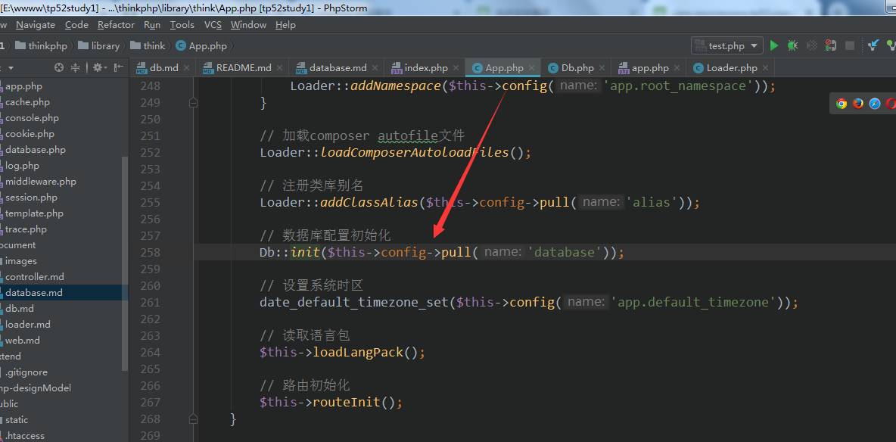  

- Db的静态骚操作  
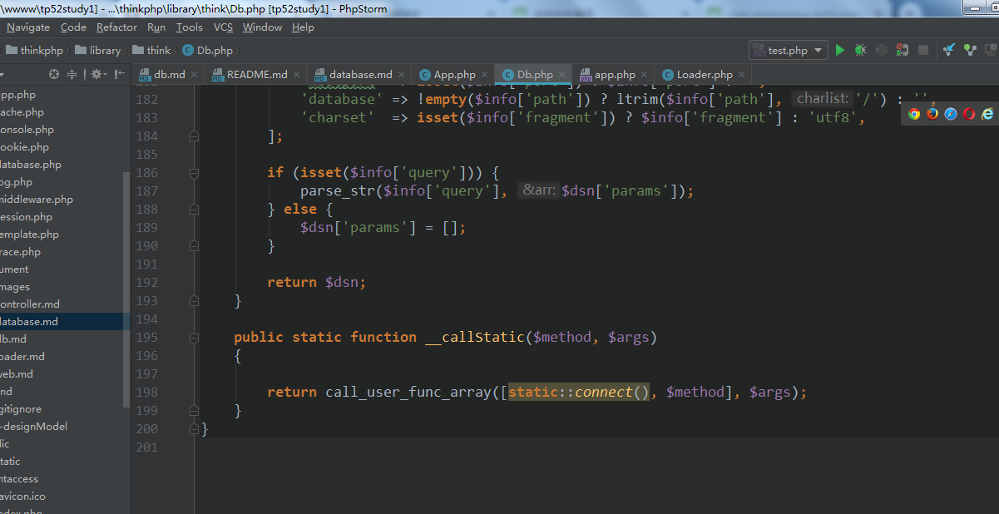  
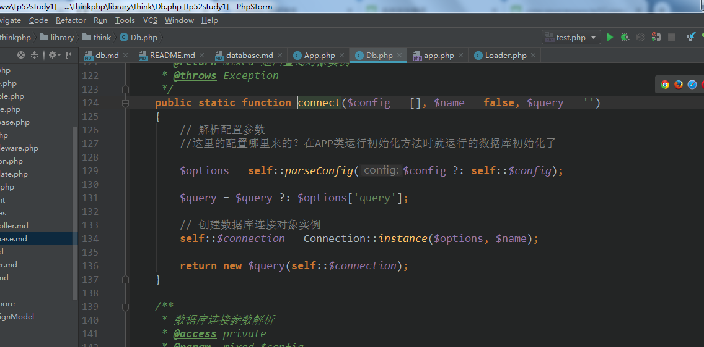  
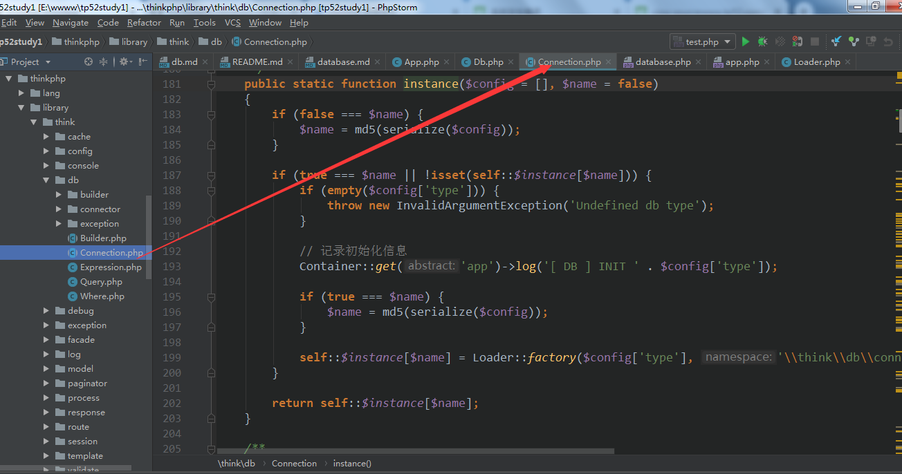  
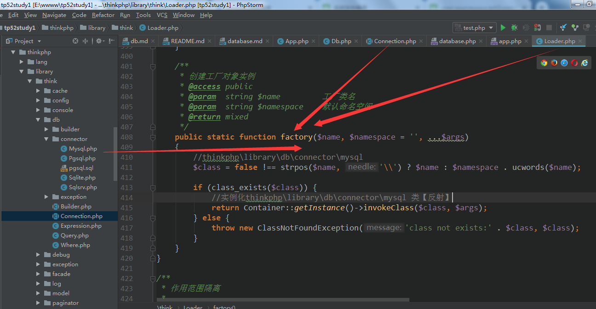    

到这里时，是读取配置文件database的type实例mysql连接器返回   
最终实例化查询构造器返回   
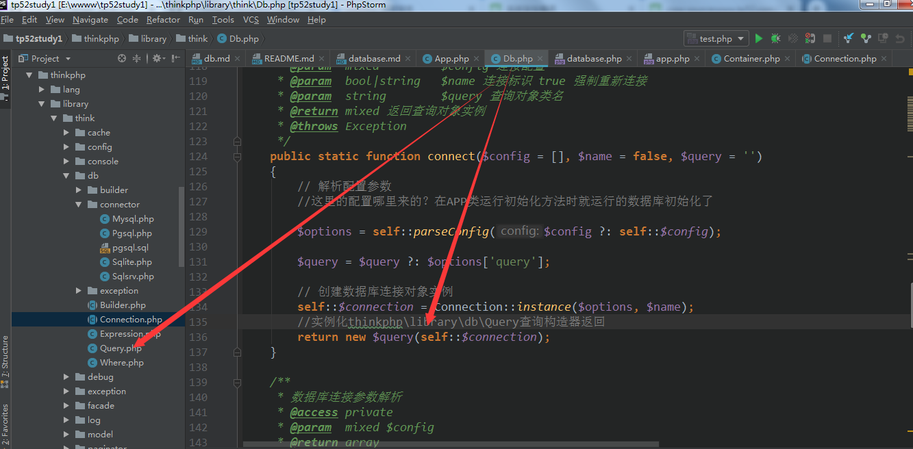    
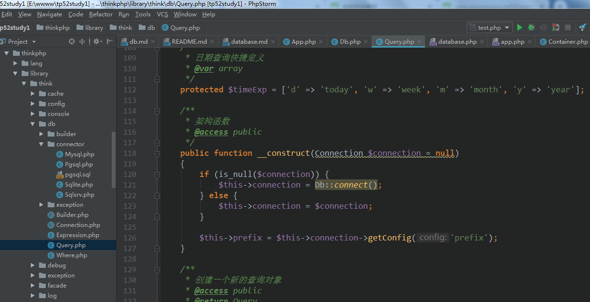      

注意thinkphp\library\db\connector\Mysql 是继承了
thinkphp\library\db\Connection的哦    

关系图   连接器   
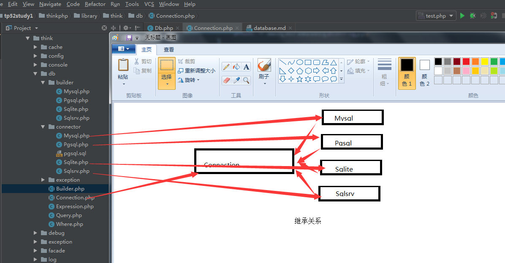

关系图   sql构造器   
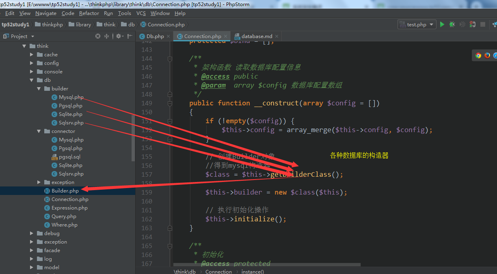  

终上所运行的结果是   
Db->Connection(Mysql,Pgsql,Sqlite,Sqlsrv)【Mysql配置文件指定的】  

Connection【builder】->(builder/Mysql,builder/Pgsql,builder/Sqlite,builder/Sqpsrv)【Mysql数据库配置】    

thinkphp\library\think\db\Query依赖Connection【Mysql】  

- Db 的原生操作  
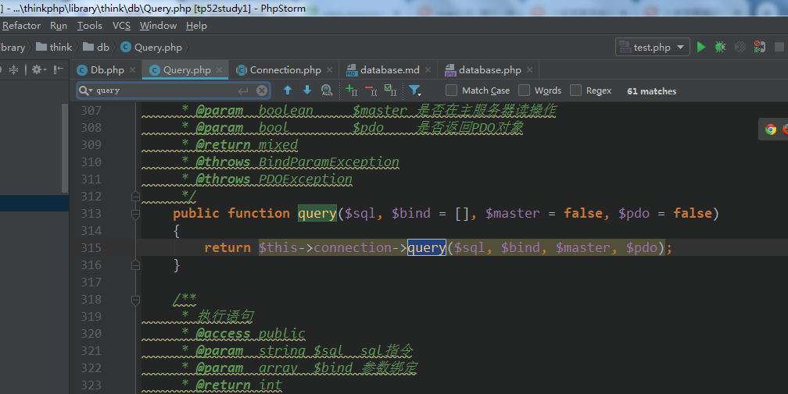
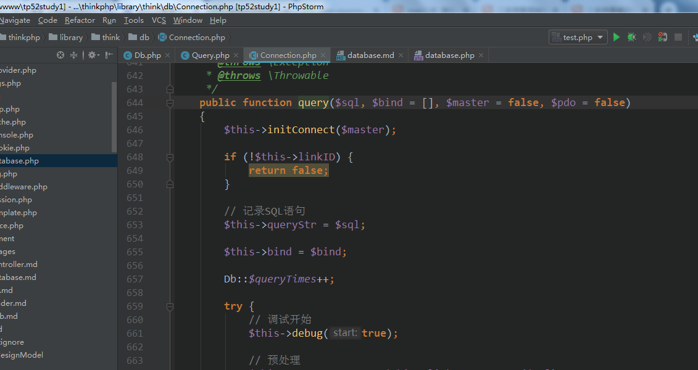
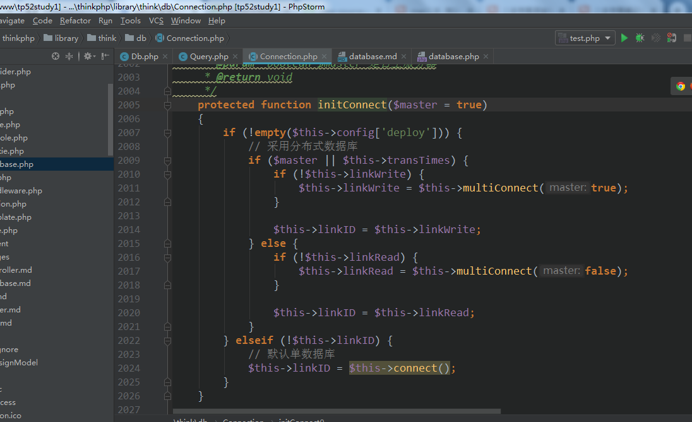
```php 
public function connect(array $config = [], $linkNum = 0, $autoConnection = false)
    {
        if (isset($this->links[$linkNum])) {
            return $this->links[$linkNum];
        }

        if (!$config) {
            $config = $this->config;
        } else {
            $config = array_merge($this->config, $config);
        }

        // 连接参数
        if (isset($config['params']) && is_array($config['params'])) {
            $params = $config['params'] + $this->params;
        } else {
            $params = $this->params;
        }

        // 记录当前字段属性大小写设置
        $this->attrCase = $params[PDO::ATTR_CASE];

        if (!empty($config['break_match_str'])) {
            $this->breakMatchStr = array_merge($this->breakMatchStr, (array) $config['break_match_str']);
        }

        try {
            if (empty($config['dsn'])) {
                $config['dsn'] = $this->parseDsn($config);
            }

            if ($config['debug']) {
                $startTime = microtime(true);
            }

            $this->links[$linkNum] = new PDO($config['dsn'], $config['username'], $config['password'], $params);

            if ($config['debug']) {
                // 记录数据库连接信息
                $this->log('[ DB ] CONNECT:[ UseTime:' . number_format(microtime(true) - $startTime, 6) . 's ] ' . $config['dsn']);
            }

            return $this->links[$linkNum];
        } catch (\PDOException $e) {
            if ($autoConnection) {
                $this->log($e->getMessage(), 'error');
                return $this->connect($autoConnection, $linkNum);
            } else {
                throw $e;
            }
        }
```   

数据库连接成功后，放在连接池里，每次直接从连接池里取出，除非连接池里的连接已经失效了   
当然也能自动重连接   
   
```php 
public function query($sql, $bind = [], $master = false, $pdo = false)
    {
        $this->initConnect($master);

        if (!$this->linkID) {
            return false;
        }

        // 记录SQL语句
        $this->queryStr = $sql;

        $this->bind = $bind;

        Db::$queryTimes++;

        try {
            // 调试开始
            $this->debug(true);

            // 预处理
            $this->PDOStatement = $this->linkID->prepare($sql);

            // 是否为存储过程调用
            $procedure = in_array(strtolower(substr(trim($sql), 0, 4)), ['call', 'exec']);

            // 参数绑定
            if ($procedure) {
                $this->bindParam($bind);
            } else {
                $this->bindValue($bind);
            }

            // 执行查询
            $this->PDOStatement->execute();

            // 调试结束
            $this->debug(false, '', $master);

            // 返回结果集
            return $this->getResult($pdo, $procedure);
        } catch (\PDOException $e) {
            if ($this->isBreak($e)) {
                return $this->close()->query($sql, $bind, $master, $pdo);
            }

            throw new PDOException($e, $this->config, $this->getLastsql());
        } catch (\Throwable $e) {
            if ($this->isBreak($e)) {
                return $this->close()->query($sql, $bind, $master, $pdo);
            }

            throw $e;
        } catch (\Exception $e) {
            if ($this->isBreak($e)) {
                return $this->close()->query($sql, $bind, $master, $pdo);
            }

            throw $e;
        }
    }
```    

连接数据库，执行sql原生操作，执行失败后检测是否要重新连接执行【即断线重新连接】  
结果处理  
```php 
protected function getResult($pdo = false, $procedure = false)
    {
        if ($pdo) {
            // 返回PDOStatement对象处理
            return $this->PDOStatement;
        }

        if ($procedure) {
            // 存储过程返回结果
            return $this->procedure();
        }

        $result = $this->PDOStatement->fetchAll($this->fetchType);

        $this->numRows = count($result);

        return $result;
    }
```    

- `Db::table('think_user')->where('id',1)->find();` 的操作流程   
[thinkphp手册](https://www.kancloud.cn/manual/thinkphp5/135176)  
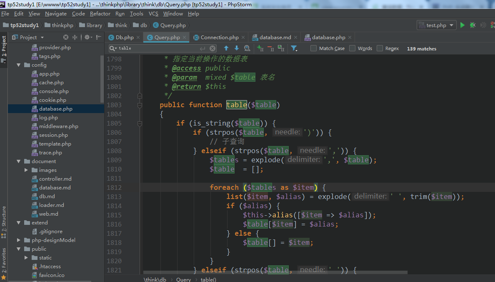
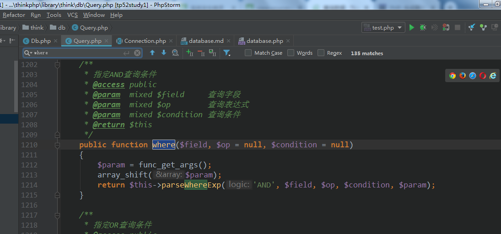
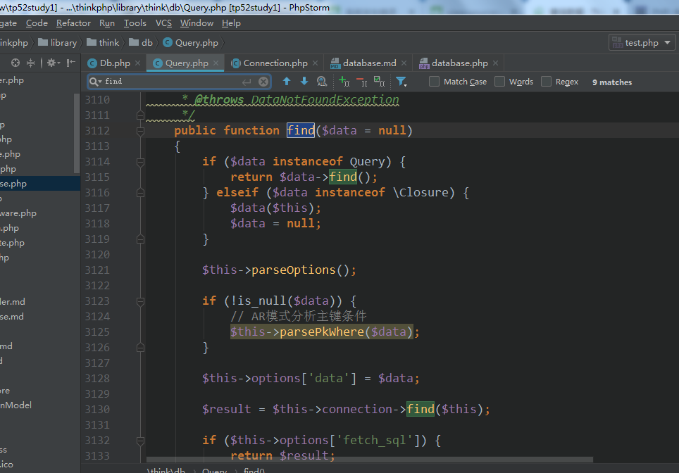
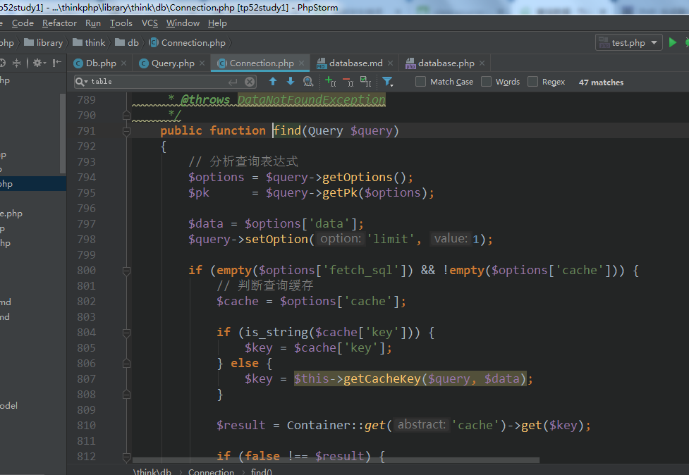
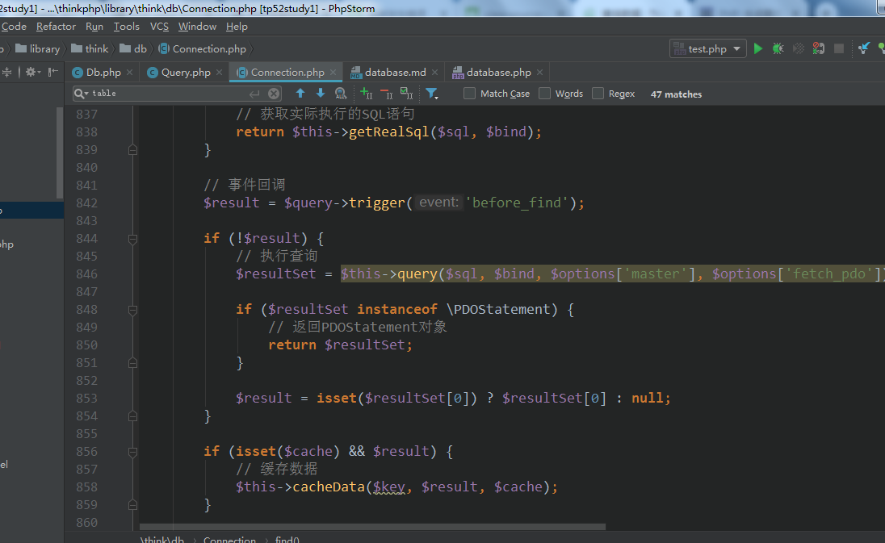   

- 数据库cursor生成器查询   
[curosr](https://www.kancloud.cn/manual/thinkphp5_1/354000)  
[yield生成器](https://www.php.net/manual/zh/language.generators.overview.php)   
[yield 生成器内存优化利器](https://www.php.net/manual/zh/language.generators.syntax.php) 

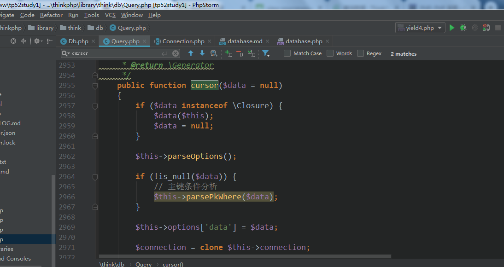
```php 
  public function getCursor($sql, $bind = [], $master = false, $model = null, $condition = null, $relation = null)
    {
        $this->initConnect($master);

        // 记录SQL语句
        $this->queryStr = $sql;

        $this->bind = $bind;

        Db::$queryTimes++;

        // 调试开始
        $this->debug(true);

        // 预处理
        $this->PDOStatement = $this->linkID->prepare($sql);

        // 是否为存储过程调用
        $procedure = in_array(strtolower(substr(trim($sql), 0, 4)), ['call', 'exec']);

        // 参数绑定
        if ($procedure) {
            $this->bindParam($bind);
        } else {
            $this->bindValue($bind);
        }

        // 执行查询
        $this->PDOStatement->execute();

        // 调试结束
        $this->debug(false, '', $master);

        // 返回结果集
        while ($result = $this->PDOStatement->fetch($this->fetchType)) {
            if ($model) {
                $instance = $model->newInstance($result, $condition);

                if ($relation) {
                    $instance->relationQuery($relation);
                }

                yield $instance;
            } else {
                yield $result;
            }
        }
    }
```   

yield 会返回一个生成器对象给循环进行迭代处理，yield循环【读取一次后会暂停并返回数据】  
处理fetch返回后，$result变量内存清空，当第二次循环时，再读取数据放入$result，同样返回   
结果，再清空$result   
而不像数组那样连续占用大量的内存!!!

