### 自动加载  
- thinkphp的加载器   
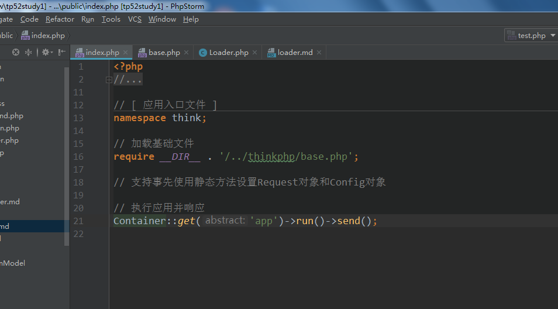 
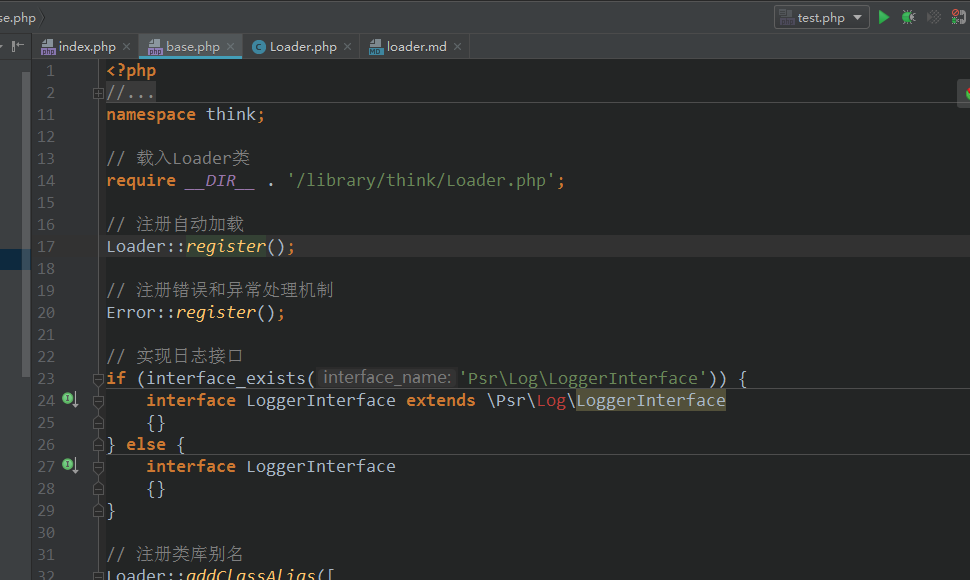 
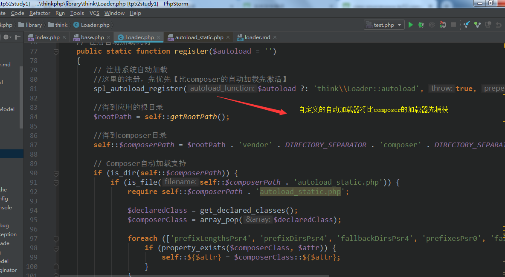 

添加命名空间(thinkphp\library\think,thinkphp\library\trait路径添加)   
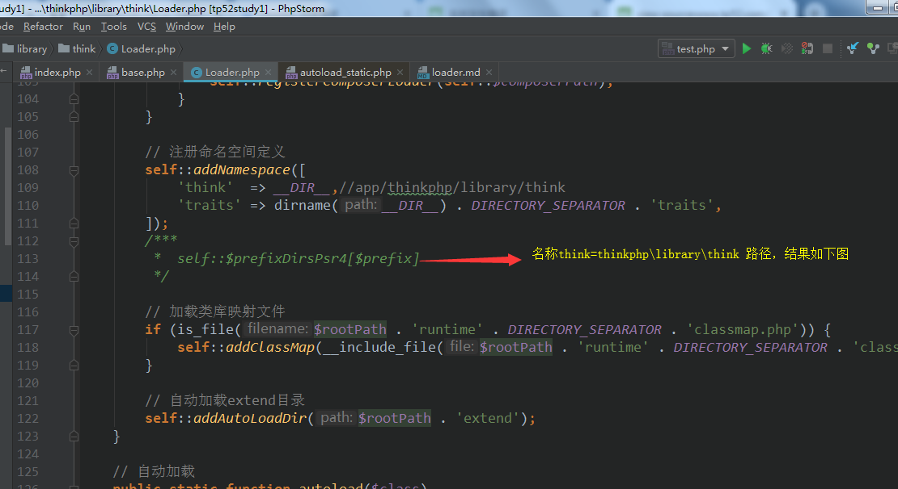 
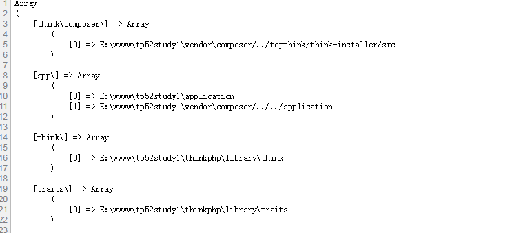   

rumtime目录下的类注册    
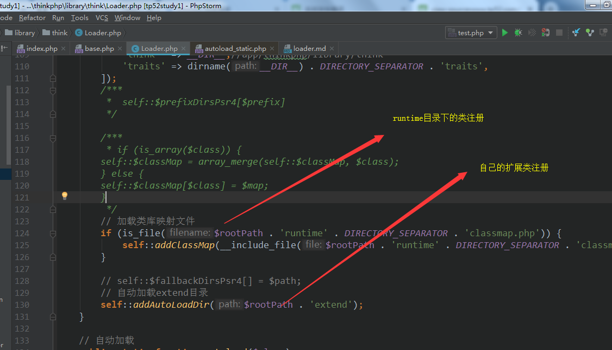  

extend扩展目录下的类注册   
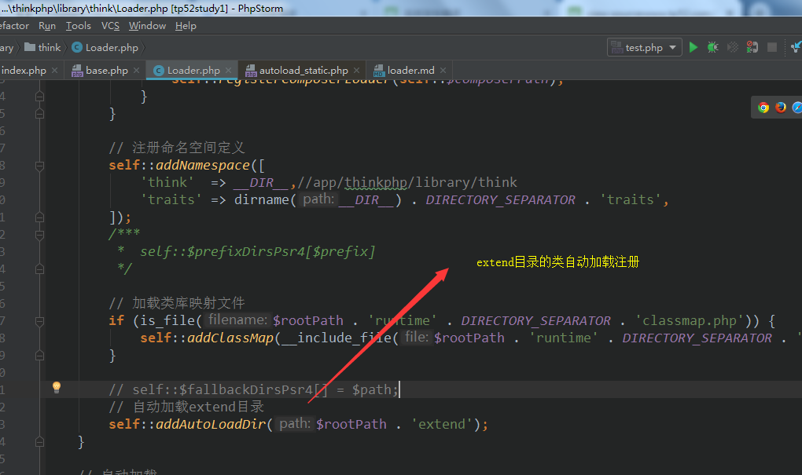   

- thinkphp的自定义异常注册  
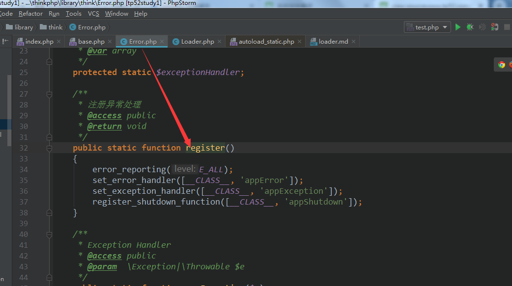    

- 注册伪装【门面类】   
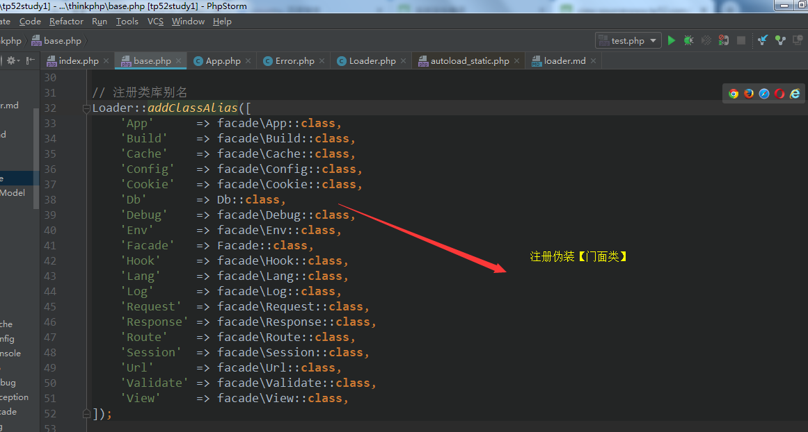    
注册保存结果如下  
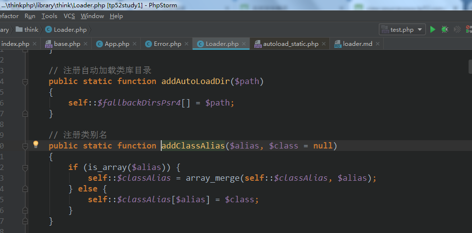    

- 伪装【门面类】的使用骚操作   
如App::xxx 或是经常用的Request:xxx()  
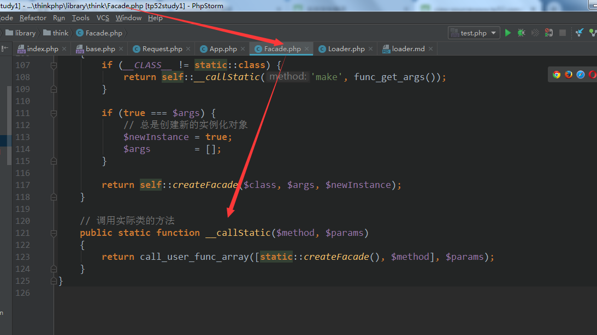    
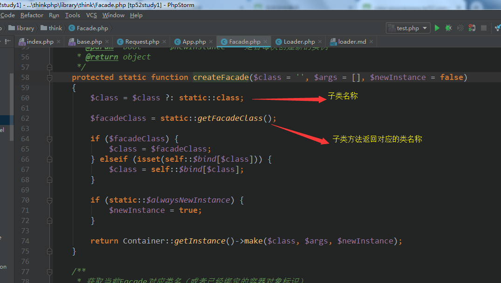    