### ORM  
- Model 的save  
```php 
$user           = new User;
$user->name     = 'thinkphp';
$user->email    = 'thinkphp@qq.com';
$user->save();
```    
这代码的运行流程   
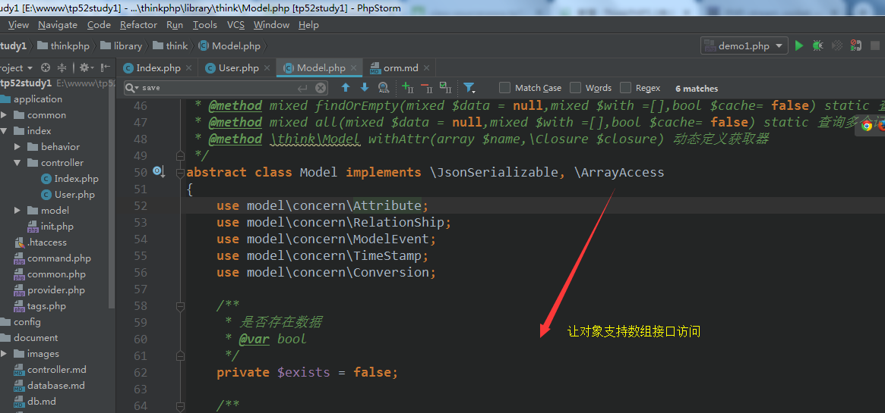
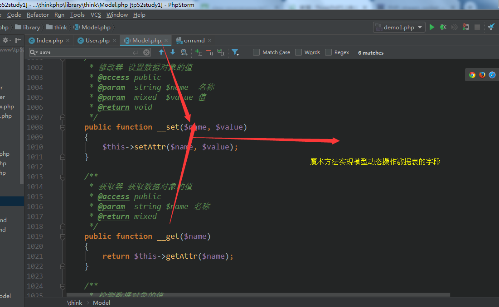
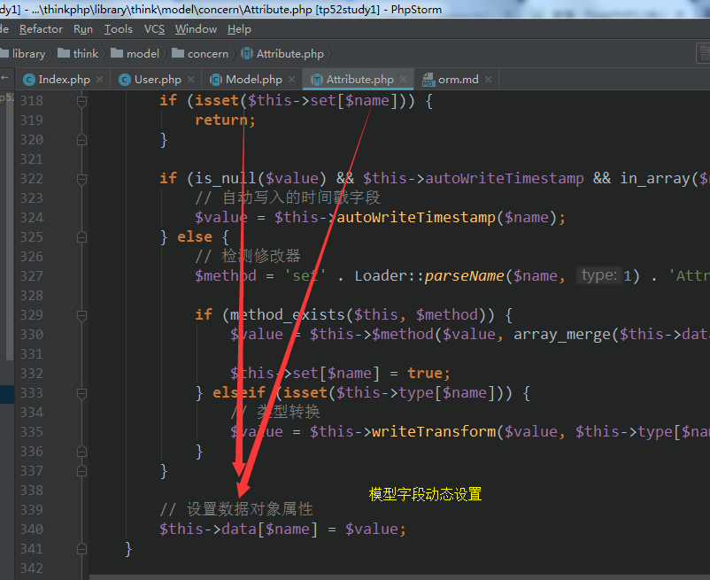
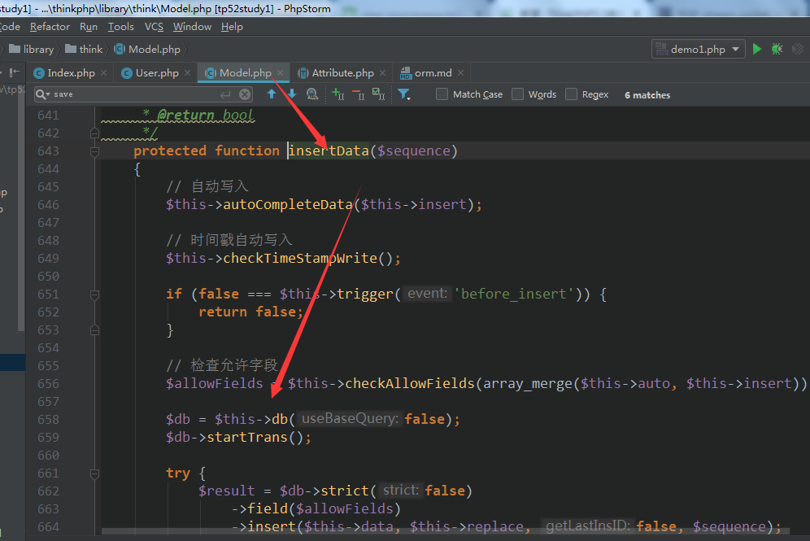
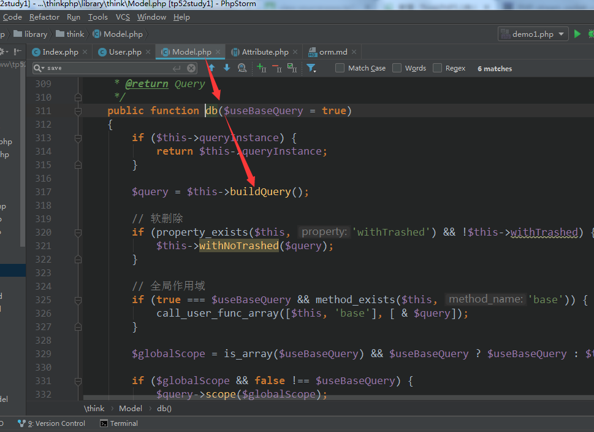
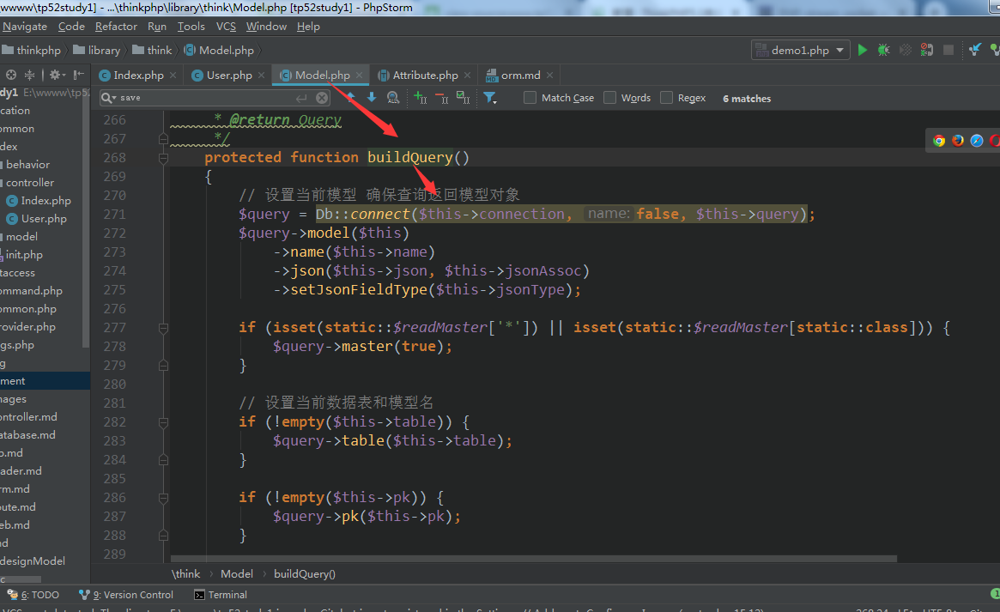
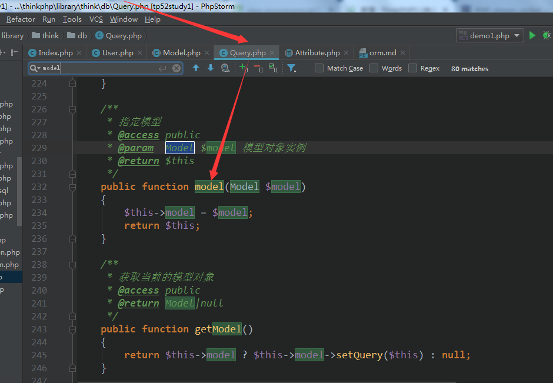
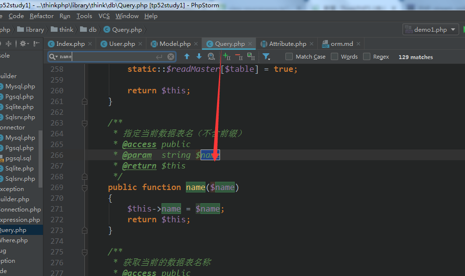
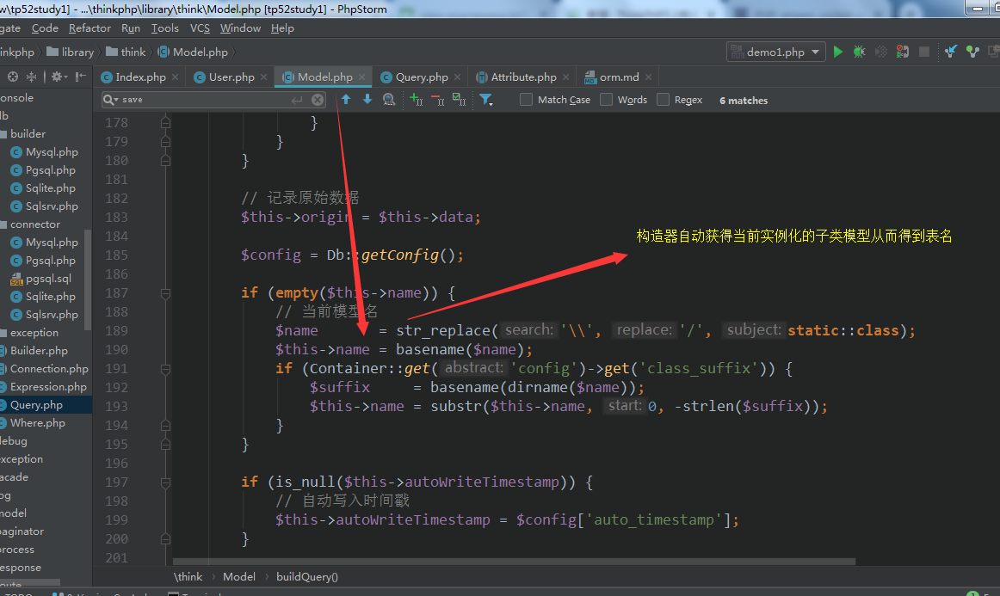
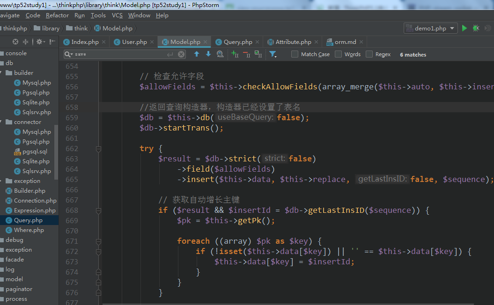
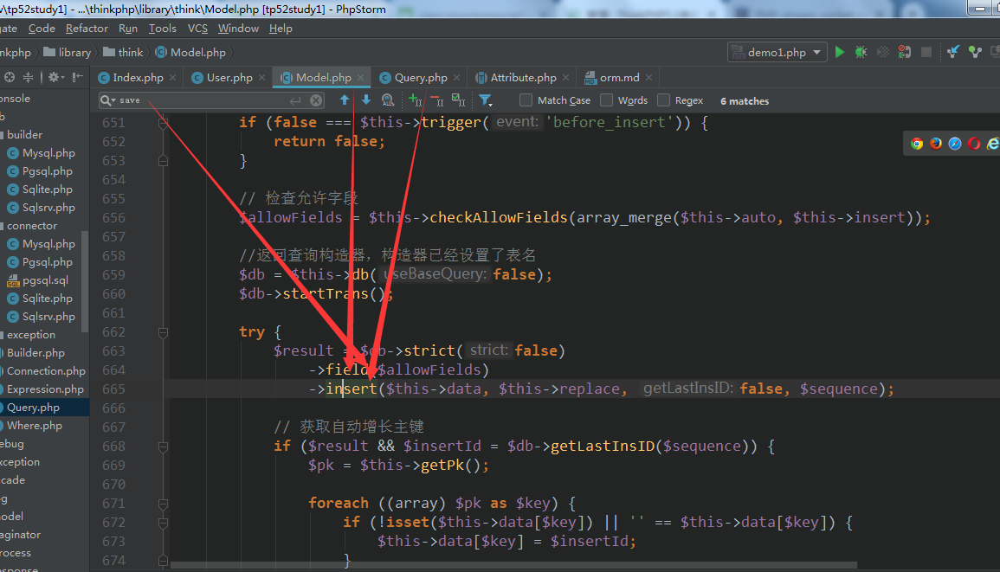
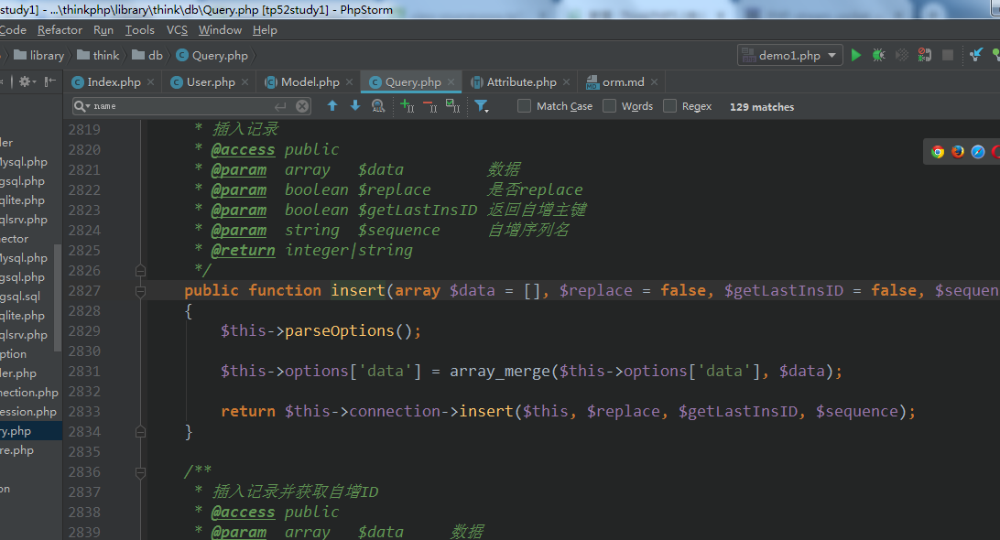   

得到结论：就是基于查询构造器的再一次封装  
在实例化User时自动获得表名，当然可以指定table重置表名   
所以这模型非常so easy
