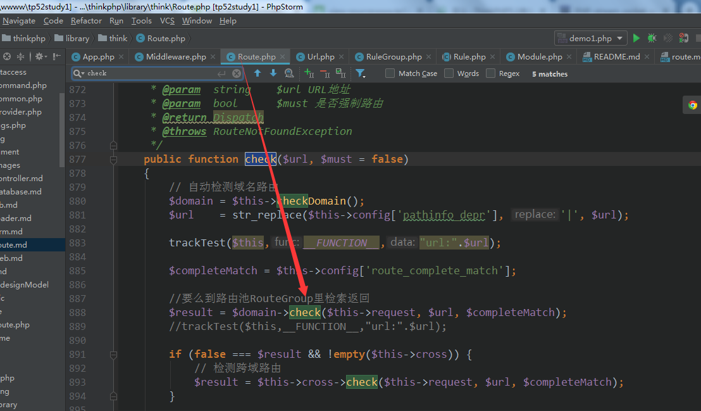

### 路由检查   
- 从RuleGroup里取出适配的路由Rule  




```php 
protected function resolve($type = 'route')
    {
        return function (Request $request) use ($type) {


//            echo "<br />";
//            echo "middleware:";
//            print_r($this->queue);
//            echo "<br />";

            //从中间件池里取出中间件
            $middleware = array_shift($this->queue[$type]);

            if (null === $middleware) {
                throw new InvalidArgumentException('The queue was exhausted, with no response returned');
            }


            list($call, $param) = $middleware;

            try {
                //运行 中间件
                //$this->resolve($type) 运行这玩意会达到递归作用，会不断的从中间件池里递归
                //除非中间件运行运行异常
                $response = call_user_func_array($call, [$request, $this->resolve($type), $param]);
            } catch (HttpResponseException $exception) {
                $response = $exception->getResponse();
            }

            if (!$response instanceof Response) {
                throw new LogicException('The middleware must return Response instance');
            }

            return $response;
        };
    }

```   

`$response = call_user_func_array($call, [$request, $this->resolve($type), $param]);`    
` 
$call是下面这玩意
$this->middleware->add(function (Request $request, $next) use ($dispatch, $data) {
             return is_null($data) ? $dispatch->run() : $data;
         });`   
         
第一个参数是当前请求对象，第二个参数是个匿名函数【`$this->resolve($type)`】   
上面的代码完成了自我递归调用     

-  控制器的运行  


   

- Url方式检测路由  

  
  


- thinkphp 路由调度大体流程  
1、路由检测，先从路RuleGroup里检索匹配的【请求方法匹配】得到路由RuleItem数组  
然后循环检测是否匹配【请求的uri,方法，规则，参数等】，如果匹配成功将当前的路由  
放入Dispatcher保存   
2、中间件运行dispatch   
运行后，Dispatch运行run方法，再运行各类调度器【支持匿名匿名函数，模块等】，会运行模块  
的exec方法，得到控制器/模块/方法并反射运行得到响应   

3、从路由RuleGroup里检索不到就走默认的URiDispatcher，这个更简单了   

终上得出thinkphp的路由并不复杂，就是操作骚   


