## web应用流程注解  
1.实例化app  
```php 
// +----------------------------------------------------------------------
// | ThinkPHP [ WE CAN DO IT JUST THINK ]
// +----------------------------------------------------------------------
// | Copyright (c) 2006-2018 http://thinkphp.cn All rights reserved.
// +----------------------------------------------------------------------
// | Licensed ( http://www.apache.org/licenses/LICENSE-2.0 )
// +----------------------------------------------------------------------
// | Author: liu21st <liu21st@gmail.com>
// +----------------------------------------------------------------------

// [ 应用入口文件 ]
namespace think;

// 加载基础文件
require __DIR__ . '/../thinkphp/base.php';

// 支持事先使用静态方法设置Request对象和Config对象

// 执行应用并响应
Container::get('app')->run()->send();
```   
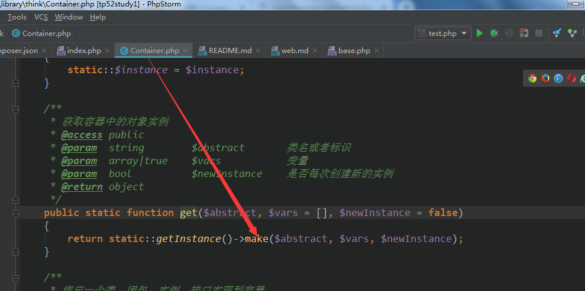
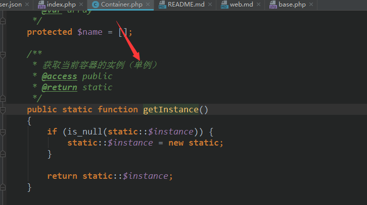 

```php 
/**
     * 根据传递的类别名从bind池里取出对应的具体类，具体类是匿名函数直接运行
     * 是类反射为对象返回，如果不需要重复实例化，就会放进已经实例化好的实例池里instances[]
     *
     *
     * 创建类的实例
     * @access public
     * @param  string        $abstract       类名或者标识
     * @param  array|true    $vars           变量
     * @param  bool          $newInstance    是否每次创建新的实例
     * @return object
     */
    public function make($abstract, $vars = [], $newInstance = false)
    {
        if (true === $vars) {
            // 总是创建新的实例化对象
            $newInstance = true;
            $vars        = [];
        }

        $abstract = isset($this->name[$abstract]) ? $this->name[$abstract] : $abstract;

        if (isset($this->instances[$abstract]) && !$newInstance) {
            return $this->instances[$abstract];
        }

        if (isset($this->bind[$abstract])) {

            //从已经绑定好的核心类库池里【别名】=类名
            $concrete = $this->bind[$abstract];

            //是匿名函数
            if ($concrete instanceof Closure) {
                $object = $this->invokeFunction($concrete, $vars);
            } else {
                //是类的话
                //$this->name[app] = App::class
                $this->name[$abstract] = $concrete;
                return $this->make($concrete, $vars, $newInstance);
            }
        } else {
            //反射类并实例返回
            $object = $this->invokeClass($abstract, $vars);
        }

        //不需要重复实例的话就会保存后面直接取已经实例好的
        if (!$newInstance) {
            $this->instances[$abstract] = $object;
        }

        return $object;
    }
```  
反射类  
```php 
public function invokeClass($class, $vars = [])
    {
        try {
            $reflect = new ReflectionClass($class);

            if ($reflect->hasMethod('__make')) {
                $method = new ReflectionMethod($class, '__make');

                if ($method->isPublic() && $method->isStatic()) {
                    $args = $this->bindParams($method, $vars);
                    return $method->invokeArgs(null, $args);
                }
            }

            $constructor = $reflect->getConstructor();

            $args = $constructor ? $this->bindParams($constructor, $vars) : [];

            return $reflect->newInstanceArgs($args);

        } catch (ReflectionException $e) {
            throw new ClassNotFoundException('class not exists: ' . $class, $class);
        }
    }

```  
实例化时从容器里的bind里取出，然后反射【实例】对象返回  
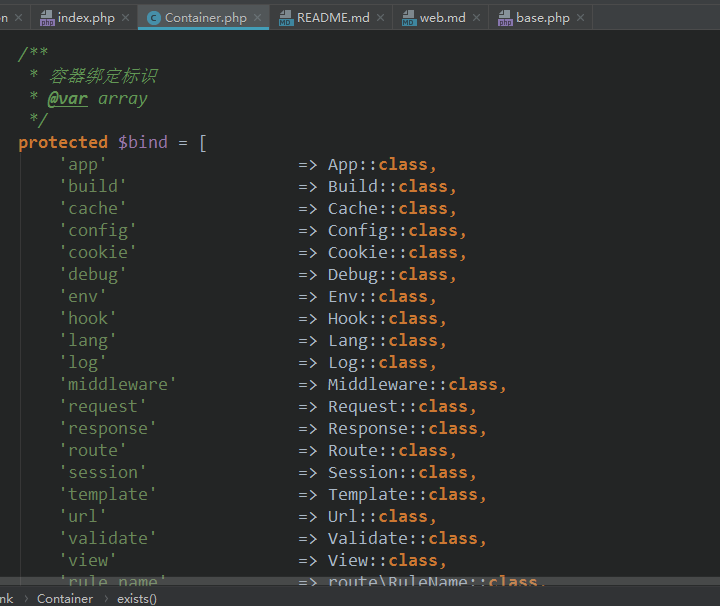  
最终返回`think\App::class`的实例  

2.运行`think\App->run` 动作  

```php 
think\App::class 
/**
     * 执行应用程序
     * @access public
     * @return Response
     * @throws Exception
     */
    public function run()
    {
        try {
            // 初始化应用
            $this->initialize();

            // 监听app_init
            $this->hook->listen('app_init');

            if ($this->bindModule) {
                // 模块/控制器绑定
                $this->route->bind($this->bindModule);
            } elseif ($this->config('app.auto_bind_module')) {
                // 入口自动绑定
                $name = pathinfo($this->request->baseFile(), PATHINFO_FILENAME);
                if ($name && 'index' != $name && is_dir($this->appPath . $name)) {
                    $this->route->bind($name);
                }
            }

            // 监听app_dispatch
            $this->hook->listen('app_dispatch');

            $dispatch = $this->dispatch;

            if (empty($dispatch)) {
                // 路由检测
                //echo "route check";
                $dispatch = $this->routeCheck()->init();
            }

            // 记录当前调度信息
            $this->request->dispatch($dispatch);

            // 记录路由和请求信息
            if ($this->appDebug) {
                $this->log('[ ROUTE ] ' . var_export($this->request->routeInfo(), true));
                $this->log('[ HEADER ] ' . var_export($this->request->header(), true));
                $this->log('[ PARAM ] ' . var_export($this->request->param(), true));
            }

            // 监听app_begin
            $this->hook->listen('app_begin');

            // 请求缓存检查
            $this->checkRequestCache(
                $this->config('request_cache'),
                $this->config('request_cache_expire'),
                $this->config('request_cache_except')
            );

            $data = null;
        } catch (HttpResponseException $exception) {
            $dispatch = null;
            $data     = $exception->getResponse();
        }

        $this->middleware->add(function (Request $request, $next) use ($dispatch, $data) {
            return is_null($data) ? $dispatch->run() : $data;
        });

        $response = $this->middleware->dispatch($this->request);

        // 监听app_end
        $this->hook->listen('app_end', $response);

        return $response;
    }
```  


  2.1 初始化应用initialize    
    将框架的目录结构保存在$_ENV，同时加载框架的应用以及对应的命名空间，运行application 
    下的初始化文件init.php，common,文件，加载tags,provider,middleware文件,以及路由初始化 
    [具体源码](../thinkphp/library/think/App.php) 
    
  2.2 路由初始化  
  ```php 
  /**
       * 路由初始化 导入路由定义规则
       * @access public
       * @return void
       */
      public function routeInit()
      {
          // 路由检测
          $files = scandir($this->routePath);
          foreach ($files as $file) {
              if (strpos($file, '.php')) {
                  $filename = $this->routePath . $file;
                  // 导入路由配置
                  $rules = include $filename;
                  if (is_array($rules)) {
                      $this->route->import($rules);
                  }
              }
          }
  
          if ($this->route->config('route_annotation')) {
              // 自动生成路由定义
              if ($this->appDebug) {
                  $suffix = $this->route->config('controller_suffix') || $this->route->config('class_suffix');
                  $this->build->buildRoute($suffix);
              }
  
              $filename = $this->runtimePath . 'build_route.php';
  
              if (is_file($filename)) {
                  include $filename;
              }
          }
      }
  ```   
  
  [路由定义](https://www.kancloud.cn/manual/thinkphp5_1/353962)  
  路由目录下的路由文件通过include 引入后，运行，触发如下代码  

  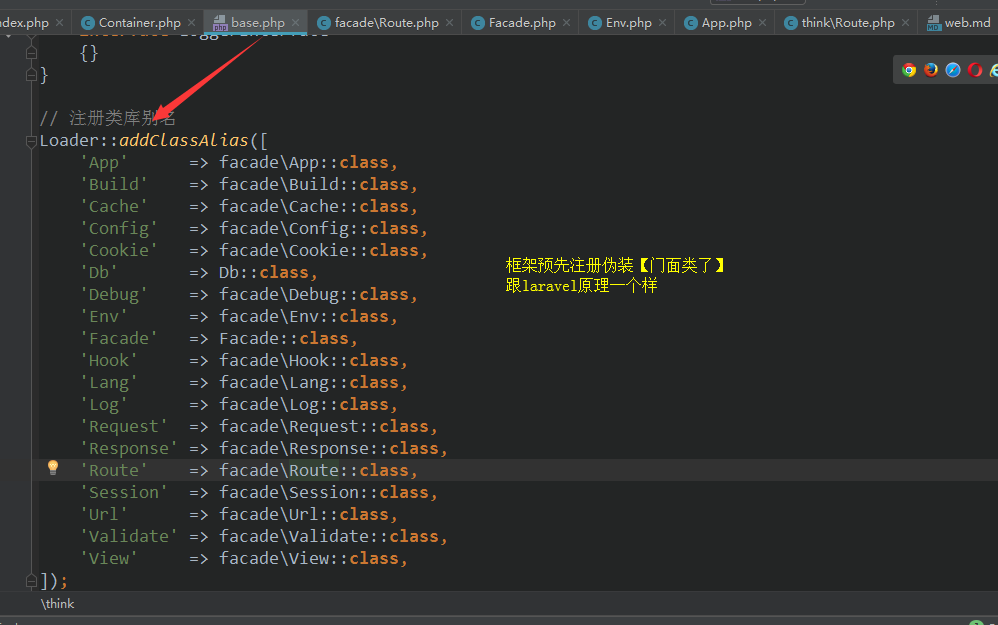
  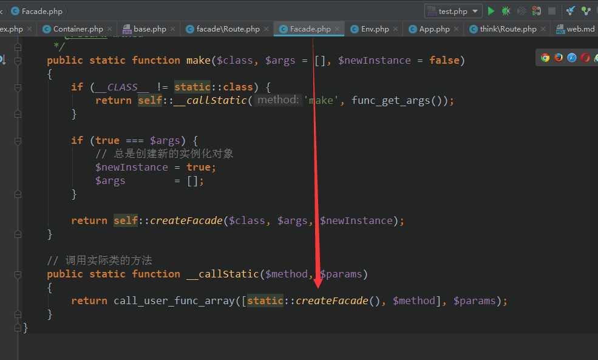
  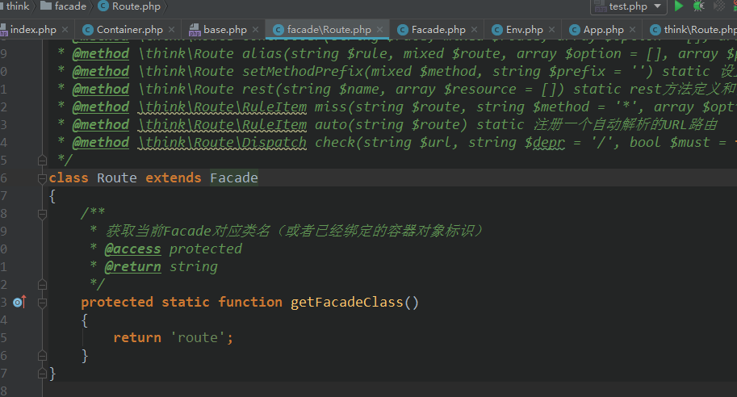
  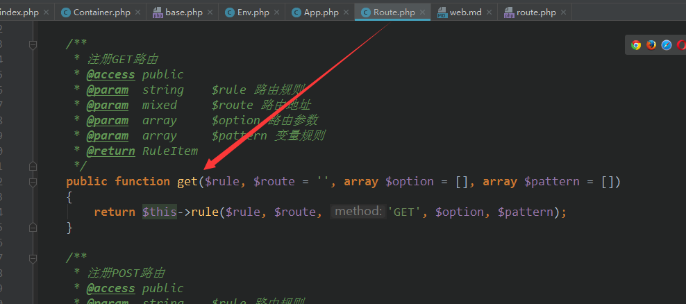
  
  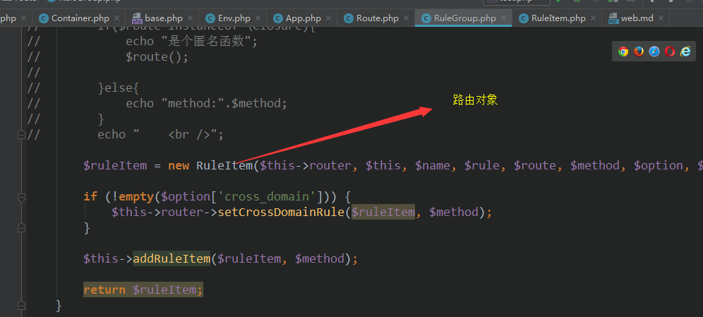
  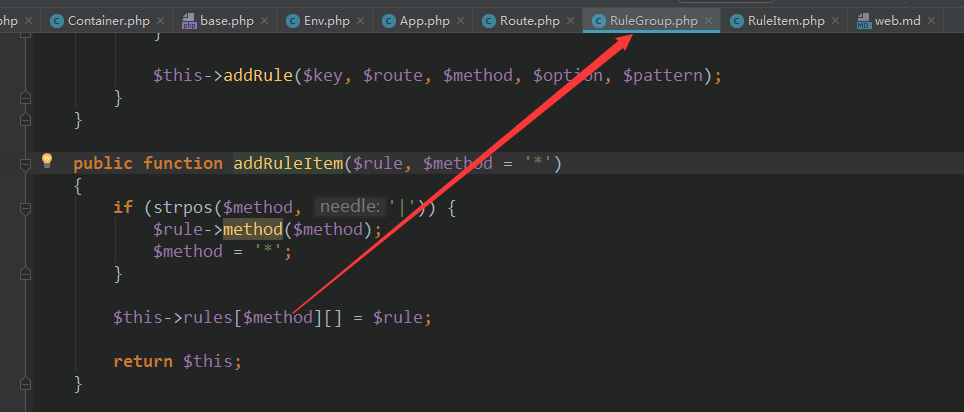  
  

继续回到run方法  

  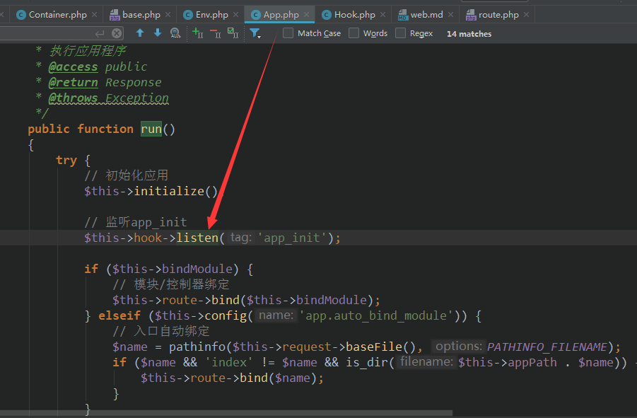  
  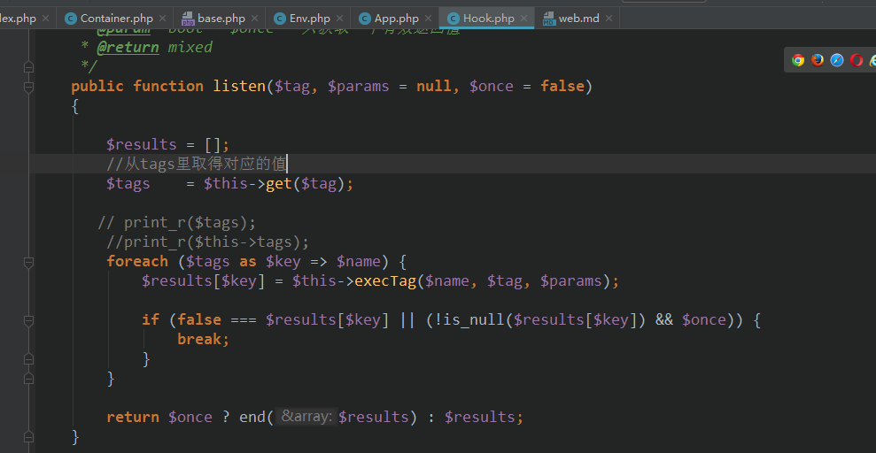  
  运行钩子配置绑定的类     
  
  路由检查  
  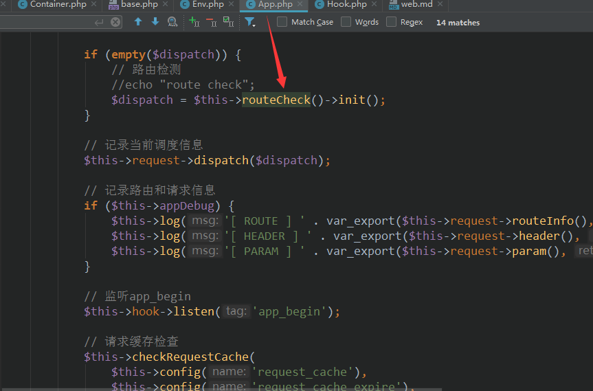 
  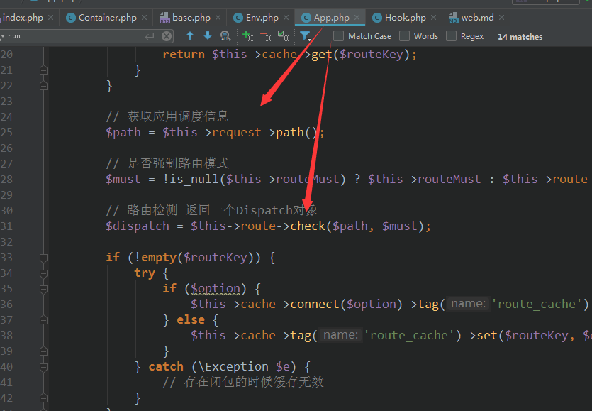 
  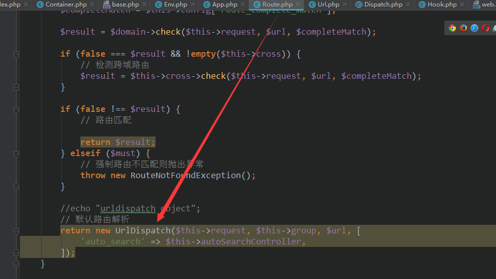 
  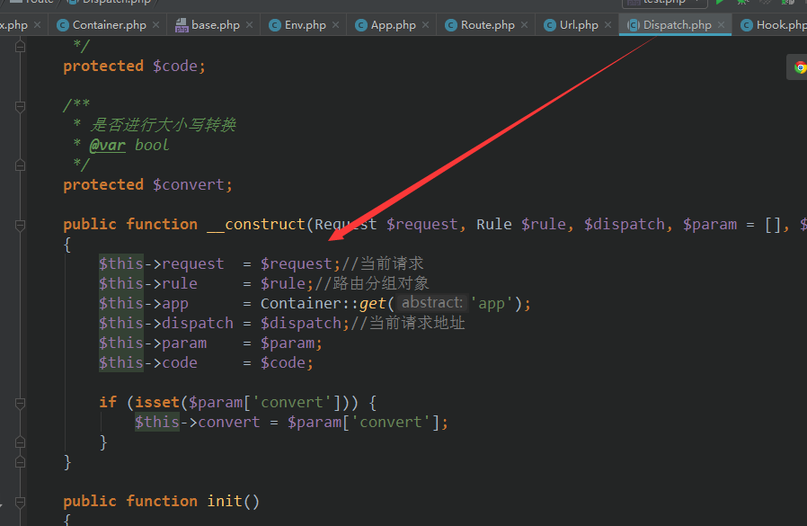 
  
运行应用【中间件调度】  
```php 
$this->middleware->add(function (Request $request, $next) use ($dispatch, $data) {
            return is_null($data) ? $dispatch->run() : $data;
        });

        $response = $this->middleware->dispatch($this->request);
```
